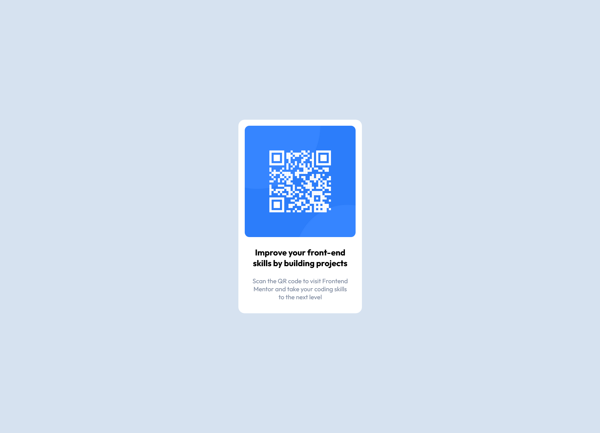

# Frontend Mentor - QR code component solution

This is a solution to the [QR code component challenge on Frontend Mentor](https://www.frontendmentor.io/challenges/qr-code-component-iux_sIO_H). Frontend Mentor challenges help you improve your coding skills by building realistic projects. 

## Table of contents

- [Overview](#overview)
  - [Screenshot](#screenshot)
  - [Links](#links)
- [My process](#my-process)
  - [Built with](#built-with)
  - [What I learned](#what-i-learned)
  - [Continued development](#continued-development)
  - [Useful resources](#useful-resources)
- [Author](#author)
- [Acknowledgments](#acknowledgments)

**Note: Delete this note and update the table of contents based on what sections you keep.**

## Overview

### Screenshot

### Links

- Solution URL: [solution URL](https://mcselle.github.io/FrontendMentor_QR_code/)

## My process

### Built with

- Semantic HTML5 markup
- CSS custom properties

### What I learned

- Css variables are pretty neat!
- Didnt really know about font weight.
- Studying the design images before getting into it.

### Continued development

Alot of small margins to the fit the design. There must be a better way.
